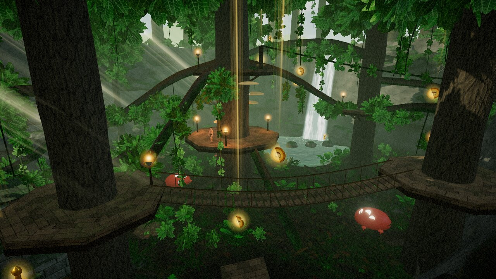

# Jungle Man

A third-person arcade **movement** game set in one small jungle grotto built around lines that
chain into each other. Run and grind along branches, hop from branch to branch, swing from vines,
run up trunks and climb onto the branches above, slide down a mud chute and bounce off giant
mushrooms. It's Tony Hawk's Pro Skater–style line hunting, moved into a jungle.



Everything is procedural: the level, the character model, rig and animation, every texture (bark, moss,
carved stone, leaves…), and all audio, including ambience, music and SFX synthesized with WebAudio.
No external assets ship with the game.

## Running it

```bash
npm install
npm run dev        # http://localhost:5173
# or a production build
npm run build && npm run preview
```

Use a desktop browser with WebGL2 (Chrome, Edge, Firefox or Safari). A PS5 DualSense works over
USB or Bluetooth through the browser Gamepad API. DualShock 4 and Xbox pads work too, and the
on-screen prompts switch to whichever device you used last.

URL options: `?quality=low|medium|high` overrides the graphics preset, `?play` skips the title
screen, and `?fps` shows a frame counter (F3 toggles it in game).

## Controls

| Action | Keyboard & Mouse | PS5 Controller |
| --- | --- | --- |
| Move | WASD | Left stick |
| Camera | Mouse (or arrow keys) | Right stick |
| Jump (hold for height) | Space | ✕ |
| Grab: grind / far catch / zip / climb | Left mouse or F | △ |
| Flip trick (stick picks direction) | Right mouse or R | □ |
| Slide · roll on landing · air pose (hold) | Shift or C | ○ / R2 / L2 |
| Spin left / right (in air) | Q / E | L1 / R1 |
| Reset camera | V or middle mouse | R3 |
| Jungle call (taunt) | G | L3 |
| Cycle trick scoring (Full / Names / Off) | H | Touchpad |
| Respawn at start | T | Create |
| Pause | Esc / P | Options |

All menus work with any of the three inputs: arrows/WASD + Enter/Esc, mouse hover + click, or
D-pad/left stick + ✕/○.

## Moves

- **Run & jump.** Speed builds up, and momentum from other moves carries over and bleeds off
  slowly. Hold jump for a higher jump. A jump right after you leave a ledge still counts
  (coyote time), and early presses are buffered. Reverse direction at speed to skid, then jump
  out of the skid for a high **Skid Flip**.
- **Branches & logs.** Land on one and you're on it, running along it with the stick. Hop
  between branches like stepping stones. Press △ / LMB (or ○ / Shift) to drop into a **grind**:
  downhill grinds pick up speed, uphill ones slow you down. Holding △ in the air catches
  branches, ropes, railings and roof ridges from further away and grinds them right away. Hold
  the stick across a branch to step off it. Branches that meet carry you on with a
  **Transfer**. While grinding, □ does a **Flip Grind** and L1/R1 does a **Switch Hop**.
- **Vines.** Touch a vine in the air and you catch it (holding △ reaches further). Push the
  stick through the bottom of the arc to pump, and jump on the upswing to let go. □ while
  swinging does a **Vine Flip**.
- **Trees.** Run into a trunk to **run up it**, or hit a big one at an angle to **spiral around
  it**. Then cling and climb or shimmy with the stick. Up + jump **climb-leaps**, and jump alone
  kicks off toward the stick. Climb or run up to a branch and you pull yourself onto it. Run a
  branch back into its trunk and you grab the trunk.
- **Ledges.** Running into waist-high obstacles **vaults** them, and in the air you grab ledges
  automatically and mantle up.
- **Slide** (○ / Shift while running). This is a low-friction power slide that speeds you up
  downhill. Slide-jump for a **Long Jump**. Hold ○ as you land to **roll** and keep your speed.
- **Mushrooms** launch you up to the nearest deck. Hold jump on contact for a **Super Bounce**.
- **Zip-vine** from the Elder Tree's crown to the east shelf. Grab it and ride it, and it
  brakes near the end.
- **Air tricks:** □ flips (front, back or side by stick direction, and tap again for doubles),
  L1/R1 spins, and holding ○ strikes a pose (Cannonball, Superman, Starfish, Jungle Call, Chest
  Pound). If you land in the middle of a flip you **bail**.

## Scoring (optional)

Settings → *Trick Scoring* (or H / the touchpad in game) cycles three options: **Full** (points,
multiplier, combo), **Names Only** (trick names, no numbers) or **Off** (a clean screen).

Each trick adds base points and +1 to the multiplier, and repeating a trick within a combo is
worth less each time. The combo stays alive while you're in the air, grinding, running a branch,
swinging, wall-running or sliding. Once you're on the ground (or standing still on a branch), a
short flow meter counts down before the combo banks. A bail loses the whole combo.

- **Gaps:** 6 named gaps (THPS-style), such as *Falls Swing*, *Mud Rocket* and *Ruin Swing*.
  Found gaps are tracked in *Gaps & Secrets*.
- **Collectibles:** spell **J-U-N-G-L-E** and find **5 golden idols**. A light beam marks each
  one. Progress is saved in your browser.
- **Score Attack:** 2 minutes to post your best total. When time runs out you can still finish
  the combo you're in.

## The Grotto

One compact jungle bowl (about 75 m across) ringed by cliffs, with a waterfall dropping into a
pool on the north side. It's built as a set of lines that feed into each other, so you can loop
the whole bowl without touching the floor:

| Line | How it flows |
| --- | --- |
| **Elder Tree** (center, spawn) | Ring deck. Bracket-fungus steps spiral up the trunk to the crown deck, and downhill **spokes** run from the crown out to the ring trees |
| **Falls Swing** | Two vines hang from an arching limb over the pool, linking the Pool Tree and the Falls Tree |
| **West Run → Ruin** | A long branch from the Falls Tree to the Ruin Tree, then a downhill branch onto the ruin's shrine roof, and a vine across to the Glade Tree |
| **Rope bridge** | Glade Tree to East Tree. Run it, or grind the hand ropes |
| **Trunk runs** | Run up the East and Pool trees to reach the high branches toward the Pool Tree and the east shelf |
| **Mud chute** | Ride the zip-vine from the crown to the east shelf, slide down the chute, and the kicker throws you onto a vine that swings you back over the Elder deck |
| **Ways back up** | Mushrooms beside the decks, a leaning log ramp up to the Elder deck, and any trunk |

## Tech

Built with [three.js](https://threejs.org) and Vite in plain JavaScript modules.

```
src/
  core/      input (KB/M + gamepad + menu nav), math/noise, events, settings
  physics/   collision world (boxes, cylinders, capsules, spheres, heightfield), rails, vines
  player/    movement state machine + tuning, skinned character, procedural animator
  world/     terrain shape, level layout, builders, render-side level view
  fx/        procedural textures, materials (moss/wind/terrain shaders), sky, water, particles, post
  audio/     WebAudio synthesis: ambience, music, SFX
  game/      game loop, camera, trick/combo system, collectibles
  ui/        HUD and menus
tests/       headless physics tests (node --test) + traversal-line diagnostics
```

- **Movement** is a fixed-substep state machine (`src/player/player.js`) against analytic
  colliders. All of the tuning lives in `src/player/params.js`.
- **The character** is one continuous surface: anatomical primitives are smooth-blended as a
  signed distance field, polygonised with surface nets (`src/player/sdf.js`) and skinned with
  distance-based weights. A procedural animator poses it for every state, with secondary motion
  on the hair and loincloth.
- **Rendering** uses splat-mapped terrain with triplanar rock, world-space moss on upward-facing
  surfaces, instanced alpha-tested foliage with wind, flow-mapped water and a waterfall, a sun
  shadow that follows the player, torch lights pooled to the nearest torches, bloom, a color grade
  and speed blur.

`npm test` runs the headless movement tests. `node tests/lines.diag.mjs` prints how the main
traversal lines play out (spokes, vine swings, the mud chute, trunk runs).
