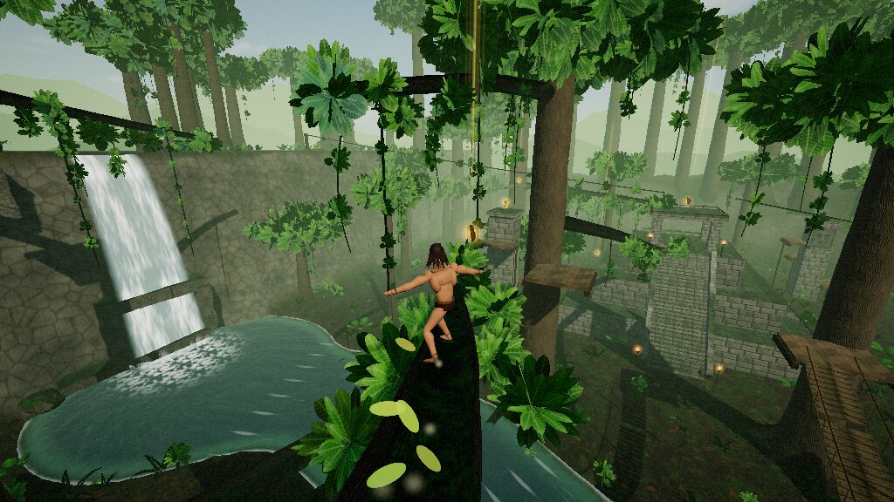

# Jungle Man

A third-person arcade **movement** game set in one compact, vertically layered jungle playground.
Grind curved branches like rails, swing from vines, run up and spiral around tree trunks, vault ledges,
bounce off giant mushrooms, ride zip-vines, and chain it all together to build momentum.
It's Tony Hawk's Pro Skater–style line hunting, moved into a jungle.



Everything is procedural: the level, the character rig and animation, every texture (bark, moss,
carved stone, leaves…), and all audio, including ambience, music and SFX synthesized with WebAudio.
No external assets ship with the game.

## Running it

```bash
npm install
npm run dev        # http://localhost:5173
# or a production build
npm run build && npm run preview
```

Use a desktop browser with WebGL2 (Chrome, Edge, Firefox or Safari). A PS5 DualSense works over
USB or Bluetooth through the browser Gamepad API. DualShock 4 and Xbox pads work too, and the
on-screen prompts switch to whichever device you used last.

URL options: `?quality=low|medium|high` overrides the graphics preset, `?play` skips the title
screen, and `?fps` shows a frame counter (F3 toggles it in game).

## Controls

| Action | Keyboard & Mouse | PS5 Controller |
| --- | --- | --- |
| Move | WASD | Left stick |
| Camera | Mouse (or arrow keys) | Right stick |
| Jump (hold for height) | Space | ✕ |
| Grab: grind / vine / zip / climb | Left mouse or F | △ |
| Flip trick (stick picks direction) | Right mouse or R | □ |
| Slide · roll on landing · air pose (hold) | Shift or C | ○ / R2 / L2 |
| Spin left / right (in air) | Q / E | L1 / R1 |
| Reset camera | V or middle mouse | R3 |
| Jungle call (taunt) | G | L3 |
| Cycle trick scoring (Full / Names / Off) | H | Touchpad |
| Respawn at start | T | Create |
| Pause | Esc / P | Options |

All menus work with any of the three inputs: arrows/WASD + Enter/Esc, mouse hover + click, or
D-pad/left stick + ✕/○.

## Moves

- **Run & jump.** Speed builds up, and momentum from other moves carries over and bleeds off
  slowly. Hold jump for a higher jump. A jump right after you leave a ledge still counts
  (coyote time), and early presses are buffered. Reverse direction at speed to skid, then jump
  out of the skid for a high **Skid Flip**.
- **Grind** (△ / LMB) near any branch, log, bridge rope, roof ridge, temple balustrade or stone
  ledge. Downhill grinds pick up speed, uphill ones slow you down and can roll you back.
  Jump off with the stick to steer, hop to a parallel rope, or run off the end to keep your
  momentum. Branches that meet carry you on with a **Transfer**. While grinding, □ does a
  **Flip Grind** and L1/R1 does a **Switch Hop**. *Grind Assist* in Settings auto-catches rails
  when you land on them.
- **Vines.** Grab in the air (you can also hold △ to catch whatever comes next). Push the stick to
  pump the swing and jump to let go. Releasing near the top of the forward arc gives the most air.
  □ while swinging does a **Vine Flip**.
- **Trees.** Jump head-on into a trunk to **run up it**. Hit it at an angle at speed to
  **spiral around it**. When the run ends you cling, then climb or shimmy with the stick. Hold up
  and press jump to **climb-leap** further up the trunk, or press jump alone to kick off toward
  the stick direction. Climbing into a branch or deck pulls you up onto it.
- **Ledges.** Running into waist-high obstacles **vaults** them, and in the air you grab ledges
  automatically and mantle up.
- **Slide** (○ / Shift while running). This is a low-friction power slide that speeds you up
  downhill, so use it on the **mud slide** hill. Slide-jump for a **Long Jump**. Hold ○ as you land
  to **roll** and keep your speed.
- **Mushrooms** launch you. Hold jump on contact for a **Super Bounce**. The one beside the
  spawn deck gets you back up to it from the ground.
- **Zip-vines** run down from the cliff top and the lookout. Grab one and ride it, and it brakes
  near the end.
- **Air tricks:** □ flips (front, back or side by stick direction, and tap again for doubles),
  L1/R1 spins, and holding ○ strikes a pose (Cannonball, Superman, Starfish, Jungle Call, Chest
  Pound). If you land in the middle of a flip you **bail**.

## Scoring (optional)

Settings → *Trick Scoring* (or H / the touchpad in game) cycles three options: **Full** (points,
multiplier, combo), **Names Only** (trick names, no numbers) or **Off** (a clean screen).

Each trick adds base points and +1 to the multiplier, and repeating a trick within a combo is
worth less each time. The combo stays alive while you're in the air, grinding, swinging,
wall-running or sliding. Once you're running on the ground, a short flow meter counts down
before the combo banks. A bail loses the whole combo.

- **Gaps:** 11 named gaps (THPS-style), such as *Vine Leap*, *River Rocket*, *Waterfall Plunge*,
  *Leap of Faith* and *Mud Rocket*. Found gaps are tracked in *Gaps & Secrets*.
- **Collectibles:** spell **J-U-N-G-L-E** and find **10 golden idols**. A light beam marks each
  one. Progress is saved in your browser.
- **Score Attack:** 2 minutes to post your best total. When time runs out you can still finish
  the combo you're in.

## The playground

| Area | What's there |
| --- | --- |
| **Great Tree** (west, spawn) | Three decks, a lookout, a branch that spirals down around the trunk, and long arms reaching toward the river, the hill and the cliff |
| **River gorge** (center) | Vines hanging from overhead arms, a high rope bridge, a fallen log, stepping stones |
| **Temple ruins** (east) | Stepped pyramid, stair balustrade grinds, a shrine roof, carved-face pillars with scaffolding, broken walls to wall-run, an arch |
| **Cliff & waterfall** (north) | Rock ledges up the cliff face, a cave behind the falls, a bridge to the cliff top, zip-vines down |
| **Mud slide** (far west) | Hilltop deck, a curving mud chute and a kicker ramp |
| **Mushroom garden** (south-west) | Bounce mushrooms climbing to a tree deck |
| **Stilt village** (south-east) | Huts on stilts with grindable ridge roofs and rope bridges |

## Tech

Built with [three.js](https://threejs.org) and Vite in plain JavaScript modules.

```
src/
  core/      input (KB/M + gamepad + menu nav), math/noise, events, settings
  physics/   collision world (boxes, cylinders, capsules, spheres, heightfield), rails, vines
  player/    movement state machine + tuning, skinned character, procedural animator
  world/     terrain shape, level layout, builders, render-side level view
  fx/        procedural textures, materials (moss/wind/terrain shaders), sky, water, particles, post
  audio/     WebAudio synthesis: ambience, music, SFX
  game/      game loop, camera, trick/combo system, collectibles
  ui/        HUD and menus
tests/       headless physics tests (node --test) + traversal-line diagnostics
```

- **Movement** is a fixed-substep state machine (`src/player/player.js`) against analytic
  colliders. All of the tuning lives in `src/player/params.js`.
- **The character** is built from smooth primitives merged into a single skinned mesh with
  blended joint weights. A procedural animator poses it for every state, with secondary motion on
  the hair and loincloth.
- **Rendering** uses splat-mapped terrain with triplanar rock, world-space moss on upward-facing
  surfaces, instanced alpha-tested foliage with wind, flow-mapped water and a waterfall, a sun
  shadow that follows the player, torch lights pooled to the nearest torches, bloom, a color grade
  and speed blur.

`npm test` runs the headless movement tests. `node tests/lines.diag.mjs` prints how the main
traversal lines play out (grinds, zips, the spiral, the mud slide).
